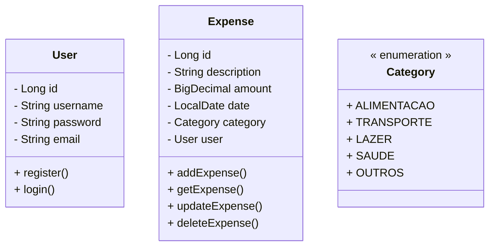

# Controle de Despesas
Este projeto é uma aplicação para controle de despesas. A aplicação permite criar, editar, visualizar e excluir despesas, além de fornecer informações sobre o total de despesas, despesas do mês atual e a categoria mais usada.

## Tecnologias

- **Frontend**: React, React Hooks:`useState` e `useEfect` , Tailwind CSS, JavaScript
- **Backend**: Java, Spring Boot, JWT, Auth0, MySQL e H2

## Funcionalidades

- **Frontend**:
  - Adicionar, editar e excluir despesas.
  - Visualizar despesas totais, total de gastos das despesas do mês e categoria mais usada.

- **Backend**:
  - Gerenciamento de usuários e despesas.
  - Autenticação com JWT e Auth0.
  - Operações CRUD para despesas.
  

## Execução

### Backend

1. Clone o repositório do backend.
2. Configure o banco de dados MySQL.
3. Compile e execute o projeto Java.

### Frontend

1. Clone o repositório do frontend.
2. Instale as dependências com `npm install`.
3. Execute o frontend com `npm start`.

## Endpoints Principais

- `POST /auth/register`: Registra um usuário.
- `POST /auth/login`: Faz login.
- `GET /expense/all`: Recupera todas as despesas.
- `POST /expense/add`: Adiciona uma nova despesa.
- `PUT /expense/update/{id}`: Atualiza uma despesa existente.
- `DELETE /expense/delete/{id}`: Exclui uma despesa.

## Contribuição

Para contribuir, faça um fork do repositório e envie um pull request com suas alterações.

## Licença

Este projeto está licenciado sob a [Licença MIT](LICENSE).
