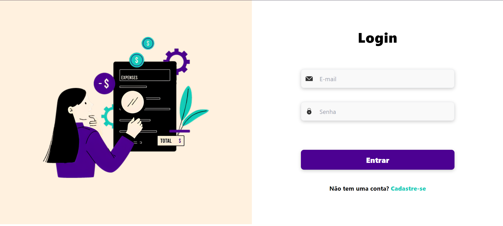
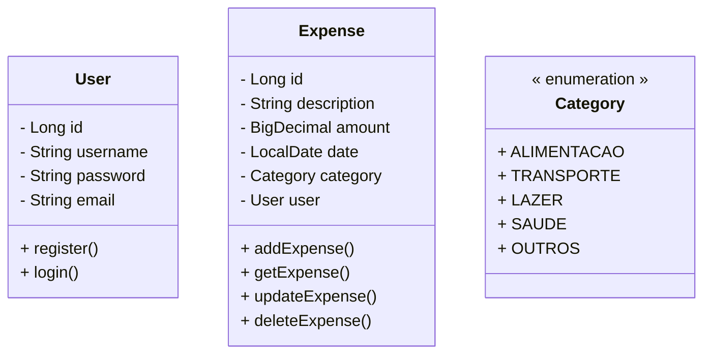

<h1 align="center">
  
   Controle de Despesas
  

      
      
      
  

</h1>
Este projeto é uma aplicação para controle de despesas. A aplicação permite criar, editar, visualizar e excluir despesas, além de fornecer informações sobre o total de despesas, despesas do mês atual e a categoria mais usada.

## 🖼️ Visualização do Projeto

### Versão Desktop

  
  

### Versão Mobile

  
  

## 🎥 Demonstração em Vídeo

Para visualizar o funcionamento do projeto: [clique aqui](https://www.linkedin.com/posts/francine-ccruz_desenvolvimentodesoftware-react-springboot-activity-7231757445746888705-OKvD?utm_source=share&utm_medium=member_desktop)

## Tecnologias

- **Frontend**: React, React Hooks:`useState` e `useEfect` , Tailwind CSS, JavaScript
- **Backend**: Java, Spring Boot, JWT, Auth0, MySQL e H2

## 🚀 Funcionalidades

### 💻**Frontend**:
  - Adicionar, editar e excluir despesas.
  - Visualizar despesas totais, total de gastos das despesas do mês e categoria mais usada.

### 🔙**Backend**:
  - Gerenciamento de usuários e despesas.
  - Autenticação com JWT e Auth0.
  - Operações CRUD para despesas.

## 📍 Diagrama

## 📦 Execução

### 🔙 Backend

1. Clone o repositório do backend.
2. Configure o banco de dados MySQL.
3. Compile e execute o projeto Java.

### 💻 Frontend

1. Clone o repositório do frontend.
2. Instale as dependências com `npm install`.
3. Execute o frontend com `npm start`.

## 📚 Endpoints Principais

- `POST /auth/register`: Registra um usuário.
- `POST /auth/login`: Faz login.
- `GET /expense/all`: Recupera todas as despesas.
- `POST /expense/add`: Adiciona uma nova despesa.
- `PUT /expense/update/{id}`: Atualiza uma despesa existente.
- `DELETE /expense/delete/{id}`: Exclui uma despesa.

## 🤝 Contribuição
1. Faça um fork deste repositório.
2. Crie uma branch para a sua feature (git checkout -b feature-nome-da-feature).
3. Faça o commit das suas alterações (git commit -m 'Adiciona nova feature').
4. Envie para o repositório remoto (git push origin feature-nome-da-feature).
5. Crie um novo Pull Request.

## 📝 Licença

Este projeto está licenciado sob a [Licença MIT](LICENSE).
